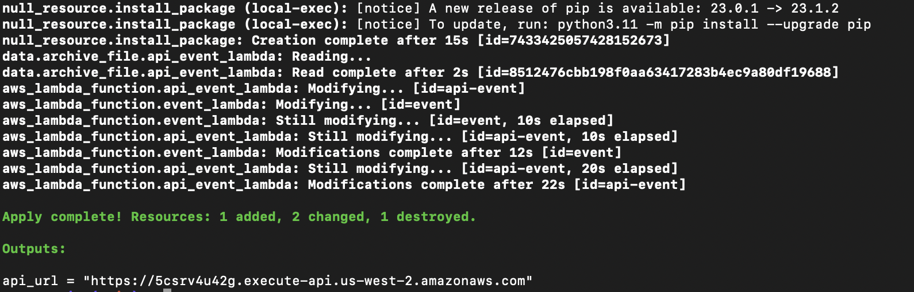
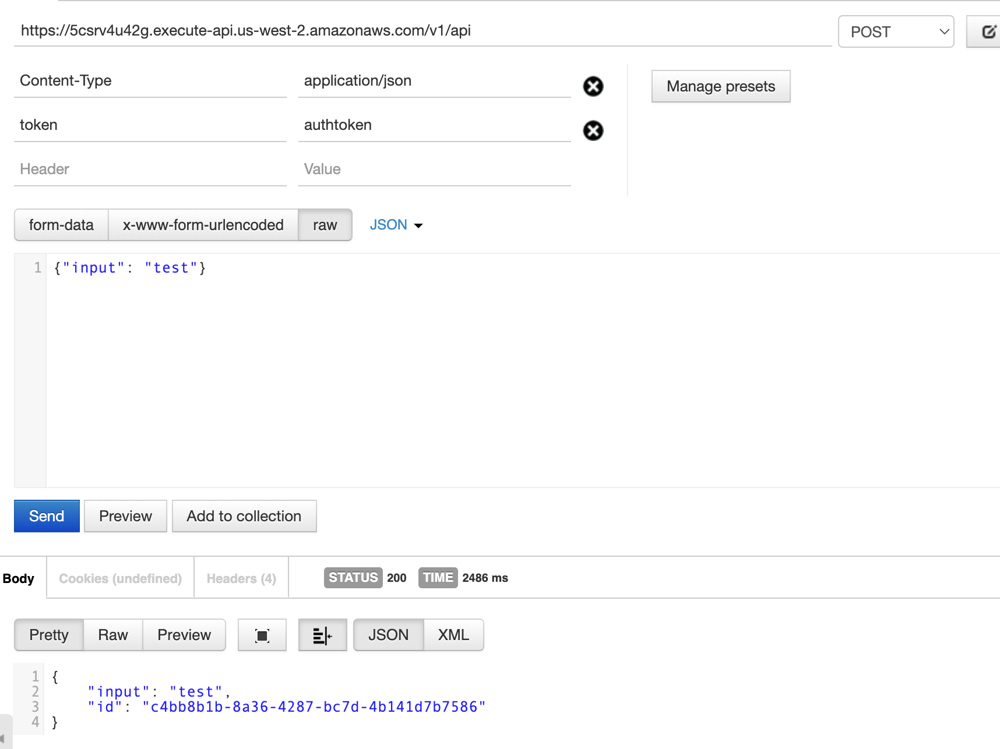
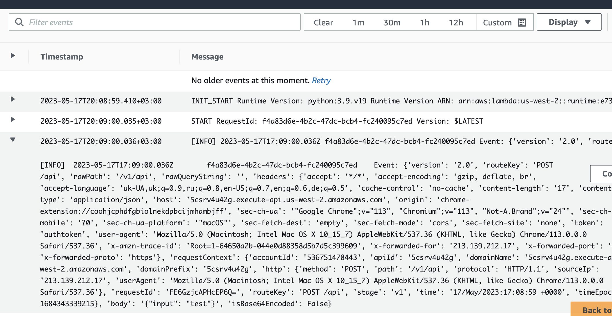
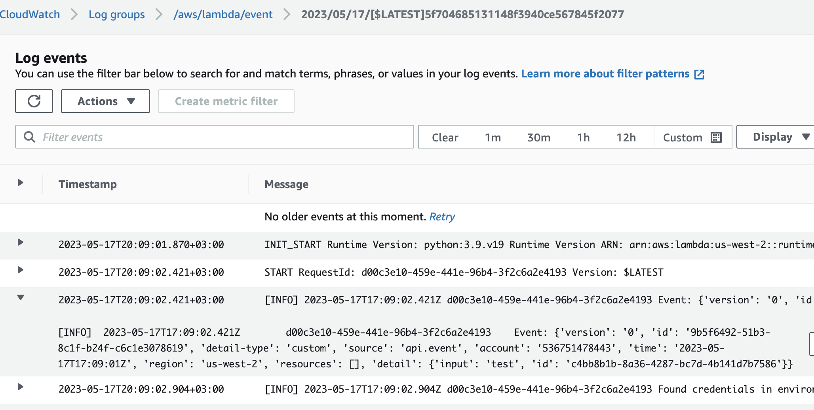
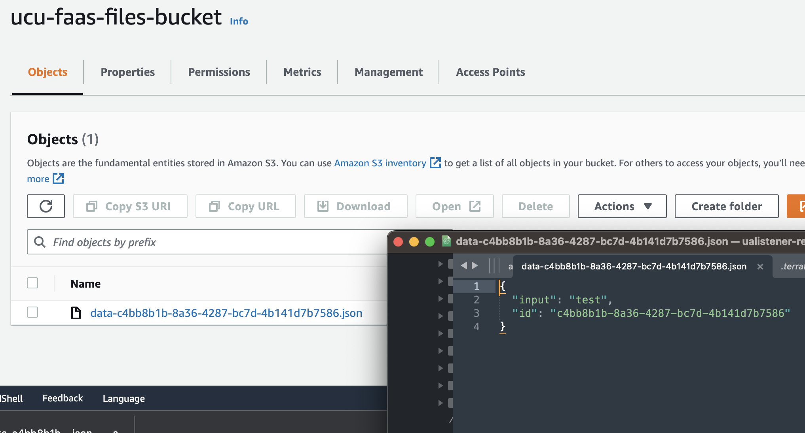
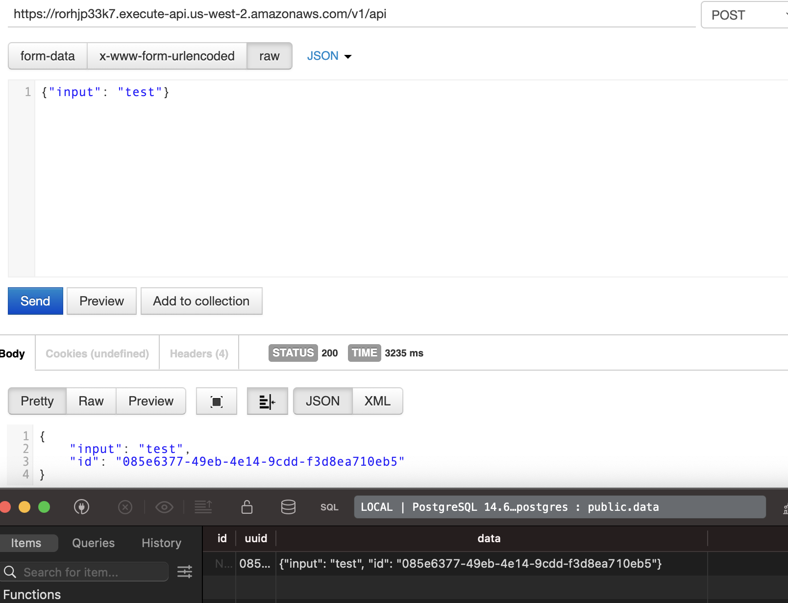

# 2. (20 pt) Function as a Service project

**The goal**: try in the wild several cloud services.

You have to implement two Functions:
- HTTP-triggered Function, which ingests event to Event Stream.
- Function automatically triggered on new event in Event Stream, and stores event content in a cloud Object Storage as json file.


## Description

Project contains the python code with implemented lambda functions 

- `api_lambda_handler` process API post request and 

- `event_lambda_handler` process EventBridge event with request payload and stores file to S3 bucket if not exists (file not exists with the probability of hash collision - function `uuid.uuid4`)

Also project implements infrastructure of communication between API Gateway, API Lambda function, EventBridge events system, Event processing lambda function, CloudWatch logs.

Project does not contain state of the infrastructure in bucket, but it is easy to extent it with few lines in the config.

Constants like name of the lambda functions, EventBridge bus or bucket where json object stores defined in the `locals.tf`

Infrastructure specific constants defined in the `variables.tf`

All IAM policies defined in the `iam.tf` file.

## How to

1. `terraform login`

2. `aws configure`  and do aws cli configuration 

3. `terraform init`

4. `terraform plan`

5. `terraform apply`

The project returns URL with implemented API in the console.



```
Outputs:

api_url = "https://5csrv4u42g.execute-api.us-west-2.amazonaws.com"
```

### Make request


To test model user should do POST request with defined `token=authtoken` in the headers. Authorization impelemted in the lambda code so we'r able to implement any custom authorization. Basic authorization can be also configured with AWS API Gateway.

POST: "https://5csrv4u42g.execute-api.us-west-2.amazonaws.com"

HEADER: 

- token=authtoken
- Content-Type=application/json

Payload: any json




User will receive posted object with updated `id` of the request.

API Gateway calls lambda function, logs for the call apears in the CloudWatch.



Lambda calls EventBridge and event lambda consequently.



Event lambda function checks file on existance and if file not exists - the new is created.



DB Lambda function receives event from EventBridge and stores payload to Postgres DB.

